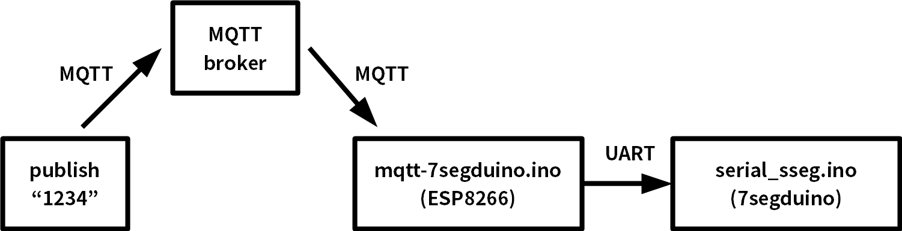

mqtt-7segduino.ino
====

serial_sseg.ino

  - https://gist.github.com/yoggy/80e47ff0932f3900c77f

How to
----

    $ git clone https://github.com/yoggy/mqtt-7segduino.git
    $ cd mqtt-7segduino
    $ cp config.ino.sample config.ino
    $ vi config.ino
    ※ edit mqtt_host, mqtt_username, mqtt_password, mqtt_subscribe_topic...
    $ open mqtt-7segduino.ino

Copyright and license
----
Copyright (c) 2018 yoggy

Released under the [MIT license](LICENSE.txt)